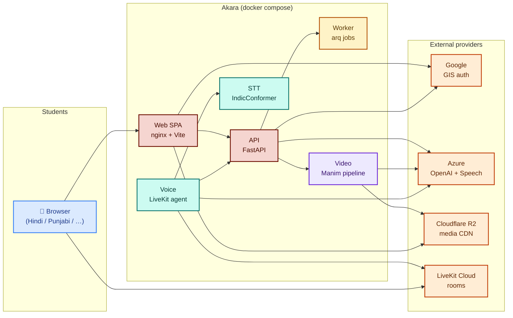
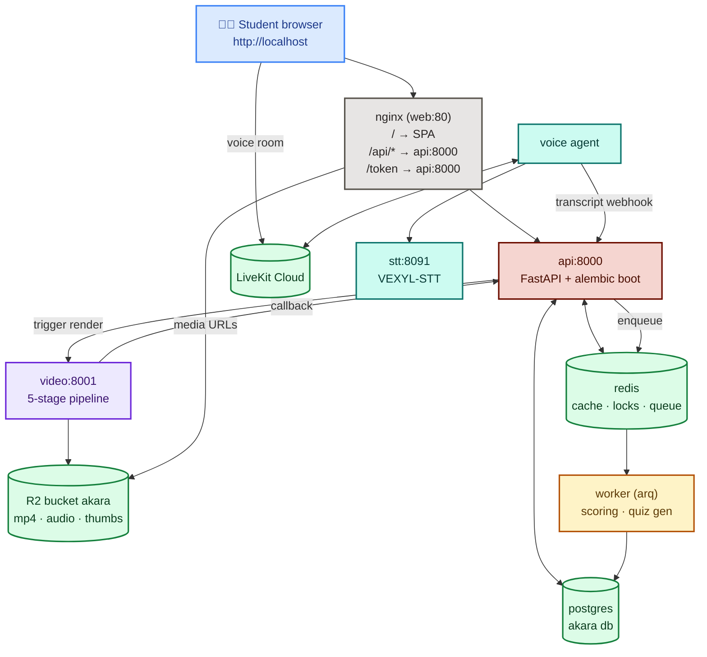
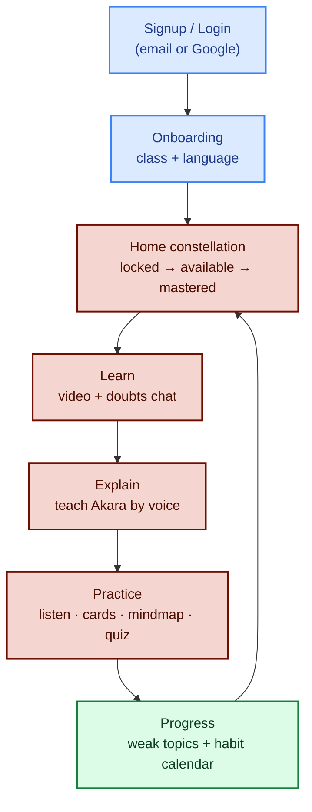

# High-Level Design (HLD)

## 1. What Akara is

Akara teaches NCERT concepts (Grades 6–12) in the student's own language:
**watch** a generated video explainer (Learn) → **teach it back** to an AI
mentor by voice or typing (Explain/Feynman check) → **practice** with
audio, concept cards, mind maps and quizzes → **track** mastery on the
Progress page. One render per concept/language serves every student.

## 2. System context

## 3. Containers (one compose stack)

| Container | Image / build | Job |
|---|---|---|
| `postgres` | `postgres:16-alpine` | 20-table source of truth |
| `redis` | `redis:7-alpine` | Cache, locks, arq queue, render slots |
| `api` | `services/api/Dockerfile` | FastAPI: auth, curriculum, media, scoring intake |
| `worker` | same image, `arq` cmd | `score_session`, `quiz_generation_task` |
| `video` | `services/video/Dockerfile` | Manim render pipeline (TeX baked in) |
| `web` | `apps/web/Dockerfile` → nginx | Vite SPA, proxies `/api` + `/token` |
| `stt` | `services/stt/Dockerfile` | Self-hosted IndicConformer STT |
| `voice` | `services/voice/Dockerfile` (`voice` profile) | LiveKit Feynman agent |

## 4. Tech stack

- **Frontend:** React 19 + Vite + Tailwind 4 + motion, same-origin `/api` (zero CORS).
- **API:** FastAPI, SQLAlchemy 2 async, Alembic, PyJWT, bcrypt, `google-auth`.
- **Jobs:** arq over Redis (dedup by job id).
- **Video:** Manim CE, Azure OpenAI (scenes/script/code-fix), Azure Speech (TTS),
  ffmpeg stitch, SadTalker optional, R2 publish.
- **Voice:** LiveKit Agents 1.2 (VAD, preemptive generation), VEXYL-STT
  self-hosted, Gemma LLM, Cartesia TTS; Azure GPT scorer with heuristic fallback.
- **Media:** Cloudflare R2 (`videos/{concept}/{lang}/{video_id}/final.mp4`), public CDN.

## 5. Core user journeys

## 6. Cross-cutting rules

- **One render per (concept, lang)** serves all students — dedup lock + shared media rows.
- **Token frugality:** quiz/scene-graph/summary generate once per (concept, lang);
  failures are capped (`retry_count`, fresh arq job ids for recovery).
- **Language rule:** explicit `?lang=` wins, else profile `default_language`, else `hi` —
  enforced identically in API, voice token, STT/TTS and prompts.
- **Mastery gate 0.7:** unlocking, Feynman bands and weak-topic flags all key off it.
