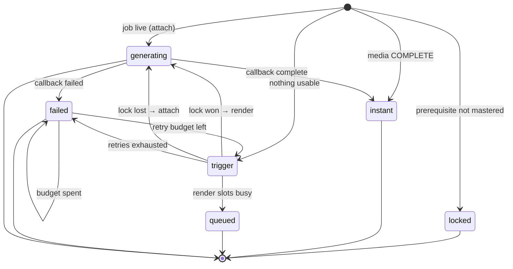
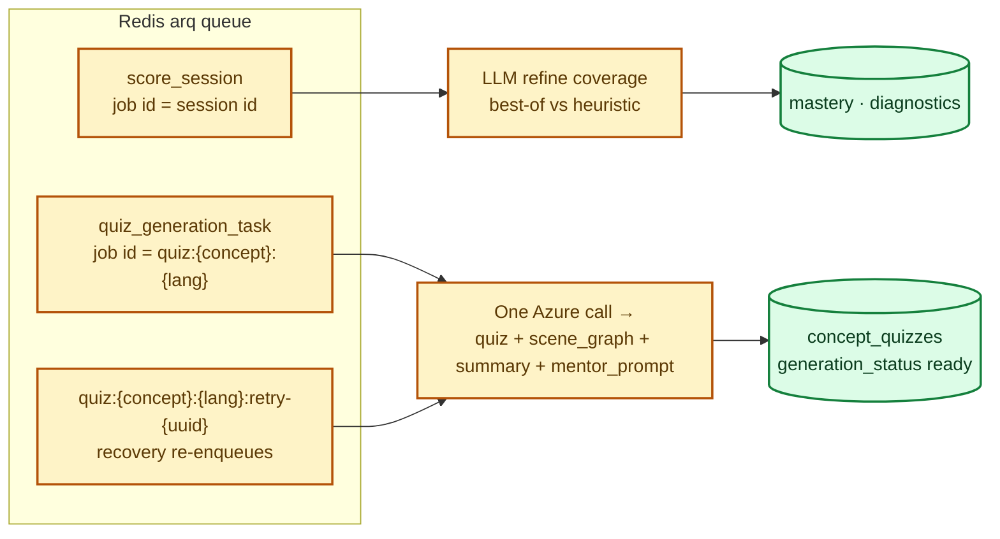
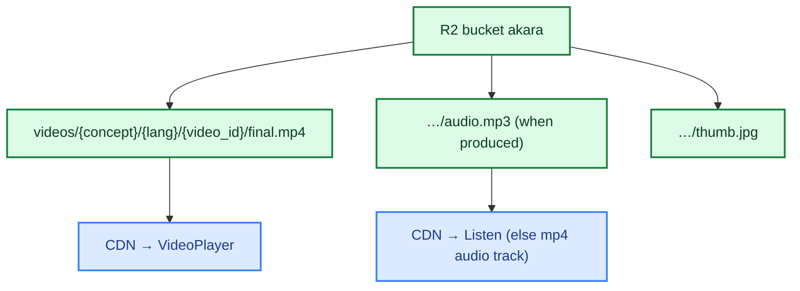

# Low-Level Design (LLD)

## 1. API modules (`services/api`)

| Router / module | Prefix | Owns |
|---|---|---|
| `routers/auth.py` | `/api/auth` | signup, login, Google (`id_token` or `access_token`), auto-create + link |
| `routers/users.py` | `/api/users` | profile get/patch, photo |
| `routers/curriculum.py` | `/api/curriculum` | subjects, chapters, constellation |
| `routers/library.py` | `/api/library` | library cards, language map |
| `routers/concepts.py` | `/api/concepts` | generation-status, media bundle, doubts chat |
| `routers/explanations.py` | `/api/concepts` | evaluate-explanation, mark-mastered (gated) |
| `routers/progress.py` | `/api/progress` | learning map, mastery overlays |
| `routers/activity.py` | `/api/activity` | heartbeat → daily minutes |
| `routers/diagnostics.py` | `/api/diagnostics` | misconception lists |
| `routers/languages.py` | `/api/languages` | language requests / demand board |
| `routers/internal.py` | `/internal`, `/token` | render-callback, LiveKit token mint |
| `routers/webhooks.py` | `/webhooks` | transcript intake (secret-guarded) |
| `security.py` | — | bcrypt, JWT, Google verify (multi-audience) |
| `queue.py` | — | arq enqueue (`score_session`, `quiz_generation_task`) |
| `quiz_gen.py` | — | one-shot quiz/scene/summary/mentor LLM call |
| `redis_client.py` | — | JSON cache, distributed locks, render slots, rate limits |
| `video_client.py` | — | render trigger → video service |
| `mastery.py` | — | coverage apply, unlock dependents |

## 2. Generation-status state machine

`GET /api/concepts/{id}/generation-status?lang=` — the single most-polled endpoint.

- Progress = stage weights (`manim_rendering` 10→65 …) + ETA ≈ 15 min.
- Stale pending jobs (>20 min, no progress) are swept and replaced once.
- In-lock live-job check: a second student attaches instead of duplicating a render.

## 3. Worker jobs (arq, `services/worker/main.py`)

## 4. Redis keys

| Key | Purpose | TTL |
|---|---|---|
| `cache:genstatus:{concept}:{lang}` | hot status polls | 2 s |
| `cache:media:{concept}:langs` | completed languages | 600 s |
| `cache:library:*` | library lists + lang map | 600 s |
| `cache:mastery:{user}` | per-user overlay | 60 s |
| `render:{concept}:{lang}` | distributed render lock | 600 s |
| render slots | D-16 global Manim cap | — |
| `arq:*` | job queue + results (dedup ids) | — |

## 5. R2 layout

## 6. Budgets that stop token waste

| Guard | Where | Effect |
|---|---|---|
| `concept_media.retry_count` + `render_max_auto_retries` (2) | `concepts.py` trigger | terminal failures stop re-rendering |
| arq dedup job ids | `queue.py` | concurrent triggers collapse to one run |
| Fresh `retry-{uuid}` ids on recovery | `get_media` fallback | crashed runs actually retry once |
| `generation_status` row marker | `quiz_gen.py` | quiz content generates exactly once per (concept, lang) |
| Localized `topic_name` cached in `summary` | `get_media` | one ~60-token call per (concept, lang), ever |
