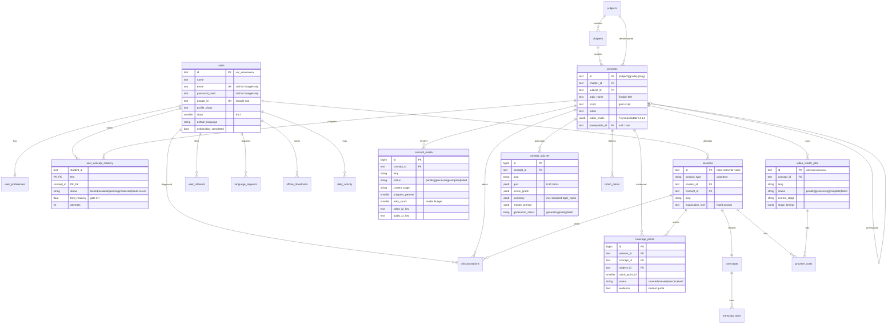
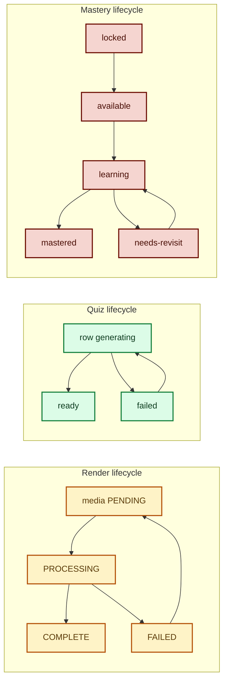

# Database — Full Map

Postgres 16 · 20 tables · `packages/akara_db/models.py` is the source of truth.
Conventions: TEXT app-generated PKs (`usr_…`, `vid-…`), `created_at` everywhere,
`updated_at` on mutable rows, JSONB for write-once blobs, TEXT enums.

## 1. Entity-relationship diagram

## 2. Table-by-table guide

### Identity — `users`, `user_preferences`, `user_interests`
One row per student. Google-only accounts have `password_hash = NULL`;
password-only accounts have `google_id = NULL`; linking fills both.
Preferences carry `data_saver_mode`; interests are free-form tags.

### Curriculum — `subjects`, `chapters`, `concepts`, `rubric_points`
`subjects` span grade bands (`class_min/max`: Science 6–10, Physics 11–12…).
`concepts.id` doubles as `topic_id` everywhere (`math10-euclid-…`).
`prerequisite_id` chains the constellation; `rubric_levels` is the Feynman
ladder (levels → points → misconceptions), flattened into `rubric_points`
for the scorer join.

### Media pipeline — `concept_media`, `video_render_jobs`, `concept_quizzes`
One `concept_media` per **(concept, lang)** — shared by all students, so one
render serves everyone. `retry_count` caps re-renders after terminal failures.
Each pipeline run is a `video_render_jobs` row (retries = new rows, latest wins).
`concept_quizzes` holds the one-shot LLM pack (quiz, scene graph, summary with
localized `topic_name`, mentor prompt) with `generation_status` as the dedup marker.

### Learning evidence — `sessions`, `transcripts`, `transcript_turns`, `coverage_points`
Voice and typed attempts are both `sessions` (voice id = LiveKit room name).
Transcripts are immutable JSON + per-turn rows (never truncated before scoring).
`coverage_points` is the audit trail: one verdict per (session, rubric point)
with the student's exact quote as evidence.

### Progress — `user_concept_mastery`, `misconceptions`
`user_concept_mastery` is the progress source of truth: `best_mastery ≥ 0.7`
flips `mastered`, unlocking dependents. `misconceptions` are the "Worth Another
Look" diagnostics (`needs_review` → `resolved` on proof of mastery).

### Personalization & cost — `language_requests`, `offline_downloads`, `daily_activity`, `provider_costs`
Demand board (unique per user/lang/month), offline packs, per-day minutes, and
one cost ledger for both voice sessions and video renders.

## 3. Enum values

| Enum | Values |
|---|---|
| `MediaStatus` | `pending` · `processing` · `complete` · `failed` |
| `VideoStage` / `RenderStage` | `queued` · `scene_planning` · `manim_rendering` · `script_generation` · `tts_generation` · `stitch_and_mux` · (`sadtalker`) · `done` · `error` |
| `MasteryStatus` | `locked` · `available` · `learning` · `mastered` · `needs-revisit` |
| `CoverageStatus` | `covered` · `missed` · `misconceived` |
| `MisconceptionStatus` | `needs_review` · `resolved` |

## 4. Key lifecycles

