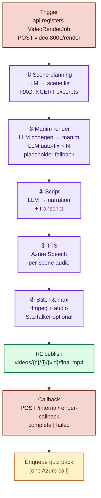
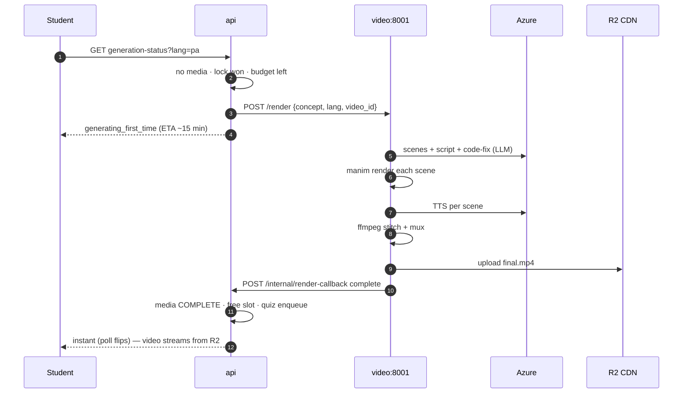
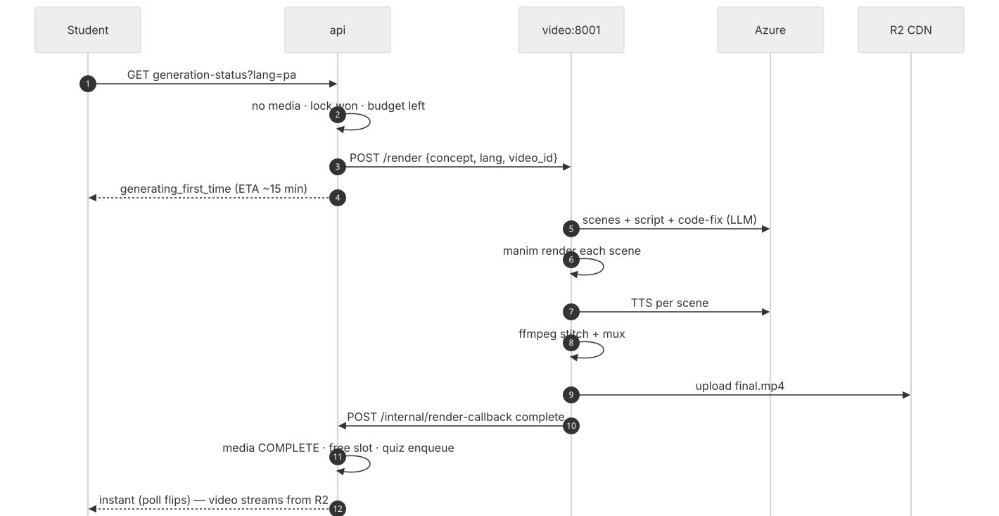
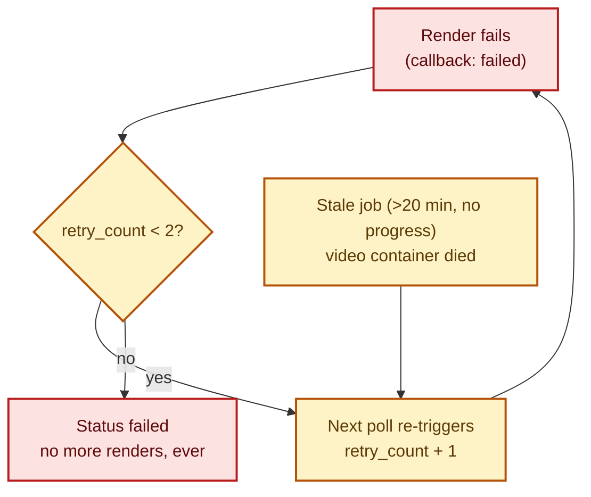

# Video Generation Pipeline

One render per (concept, lang) → every student streams the same mp4 from R2.
Code: `services/video/app/` (stages), trigger in `services/api/video_client.py`,
status gate in `services/api/routers/concepts.py`, callback in
`services/api/routers/internal.py`.

## 1. The five stages

Stage notes:

- **Scene planning** — LLM turns the gold script + NCERT RAG excerpts into a timed scene list.
- **Manim** — LLM writes Manim CE code; each scene renders in isolation; on failure the
  stderr goes back to the LLM for a fix (bounded attempts), then a black placeholder
  keeps the video watchable. Non-English text uses `Text`, never `Tex`/`MathTex`;
  pure math uses `MathTex` — compiled by the TeX baked into the image
  (`texlive-latex-base`, `dvisvgm`, `cm-super`; `/health` reports both).
- **Script + TTS** — narration generated per scene, voiced by Azure Speech in the
  target language, aligned to scene timestamps.
- **Stitch** — ffmpeg muxes scene mp4s + audio; SadTalker presenter pass is optional;
  the final audio track is extracted for the Listen activity.
- **Publish + callback** — mp4 (and audio/thumb when produced) upload to R2, then
  the video service calls back with `complete`/`failed`, R2 keys, duration and timings.

## 2. End-to-end sequence (first student triggers it)

Second student for the same concept/language: `instant` immediately — zero tokens spent.

## 3. Failure handling (the token-saving part)

- Deterministic failures (e.g. missing system dependency) can never loop forever.
- A second student arriving mid-render attaches to the in-flight job under the
  same distributed lock — never a duplicate render.
- Render slots (D-16 cap) queue excess demand instead of piling Manim jobs.
