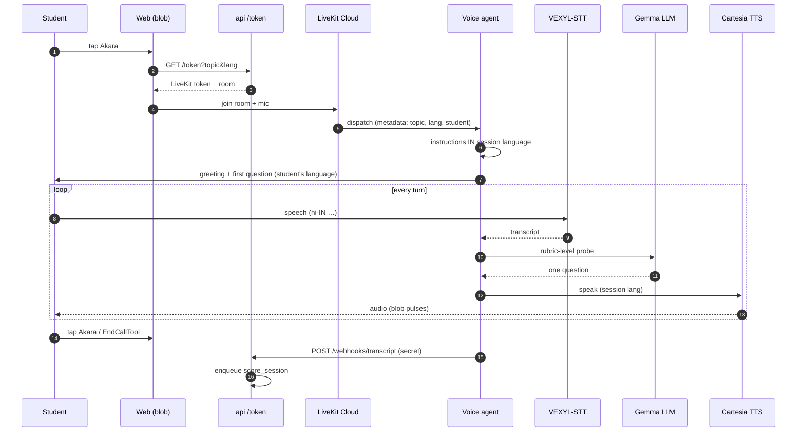
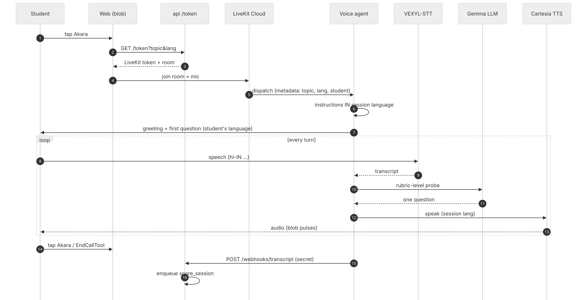
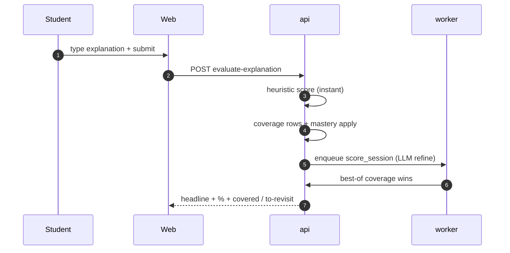
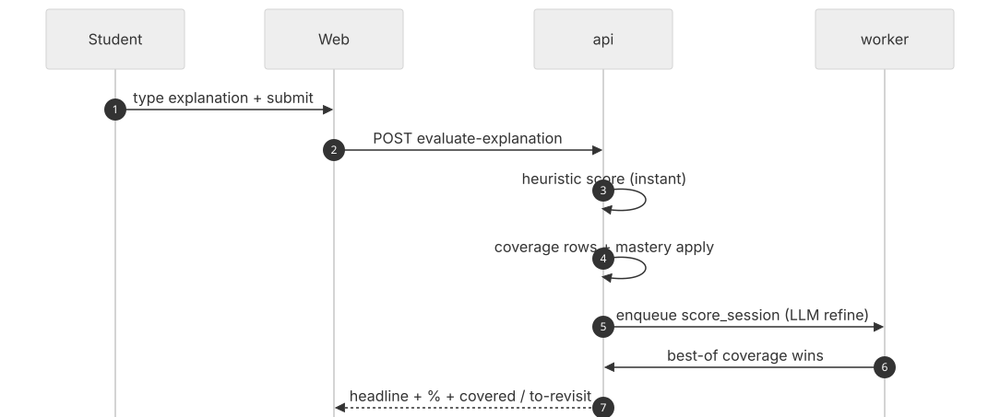
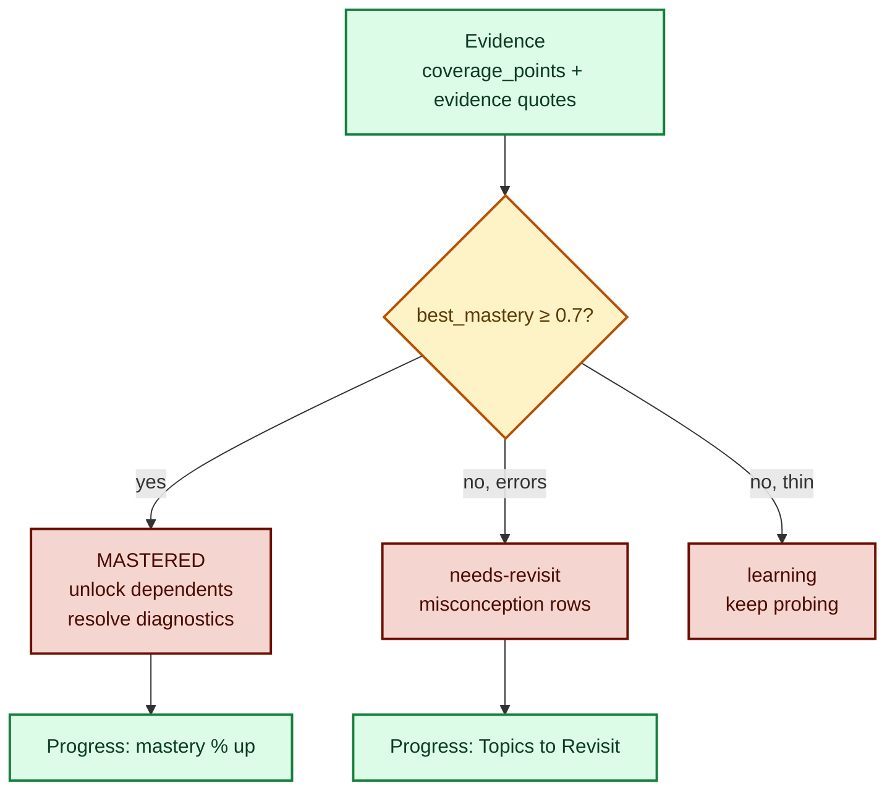

# Feynman Pipeline (Teach-It-Back)

The student explains the concept back; Akara probes the gaps until mastery.
Two loops, one scoring core. Code: `services/voice/agent.py`,
`services/api/routers/explanations.py`, `services/worker/main.py`,
`services/api/mastery.py`.

## 1. Voice loop (Explain → tap Akara → LiveKit)

- STT language is full BCP-47 (`hi-IN`); TTS voice follows the session language.
- The blob is purely visual: `user-speaking` while you talk, `blob-speaking`
  while mentor audio plays — all sound comes from LiveKit, never browser TTS.
- The agent walks rubric levels L1→L4 in order, one question per turn, and only
  ends the call when every level is evidenced (or the student stops).

## 2. Text loop (Feynman check)

- Instant heuristic (stopwords removed EN+HI, stem/substring match) answers
  immediately; the arq LLM job refines afterwards — best-of wins.
- Clearing the 0.7 gate resolves open misconception diagnostics for the concept.

## 3. Scoring → mastery → unlocks

