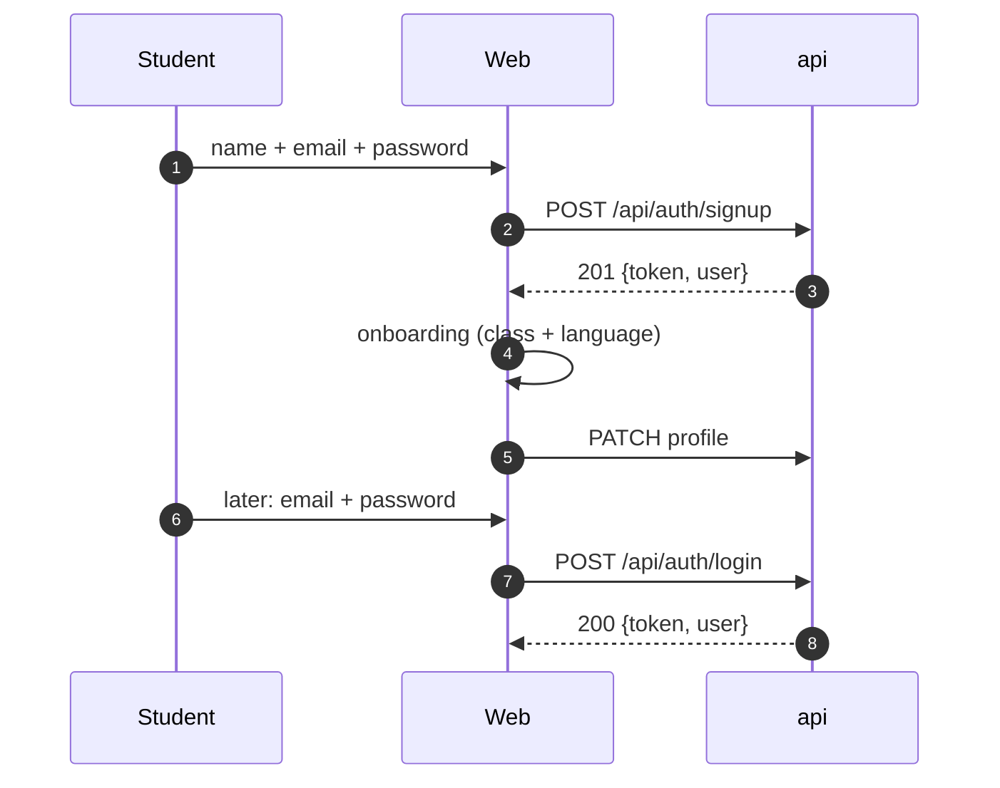
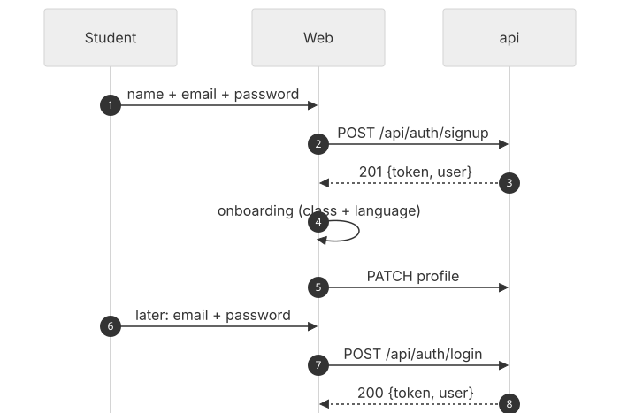
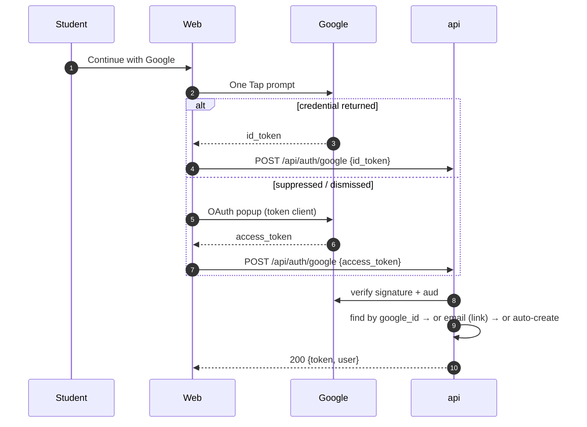
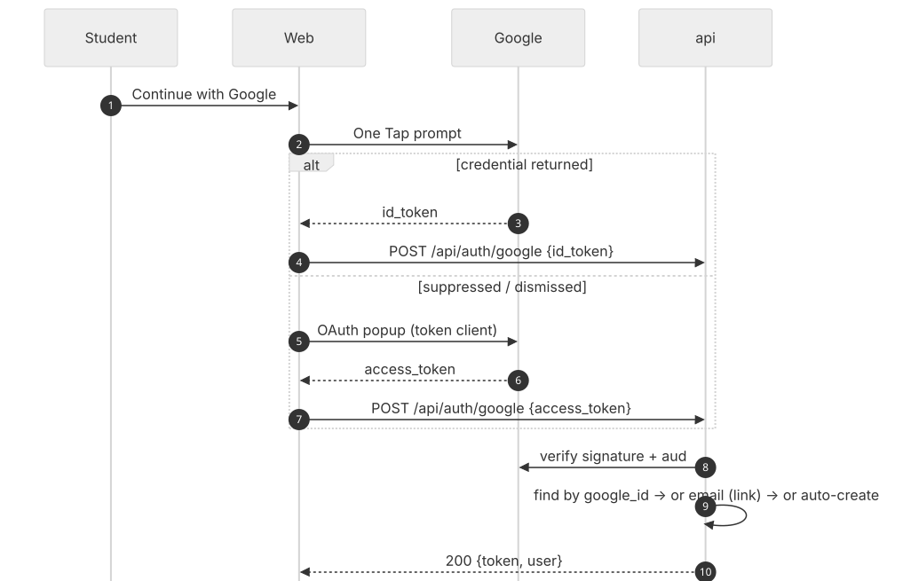
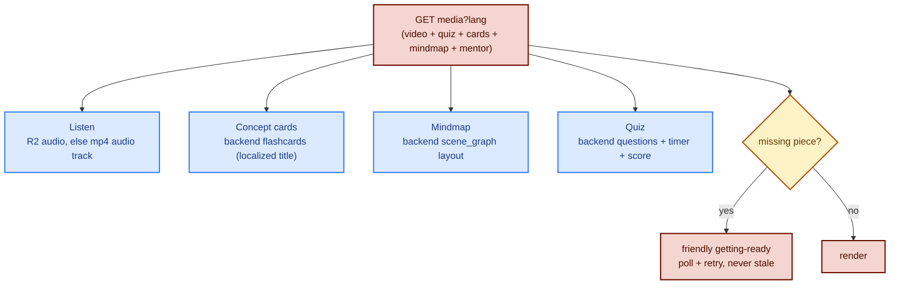
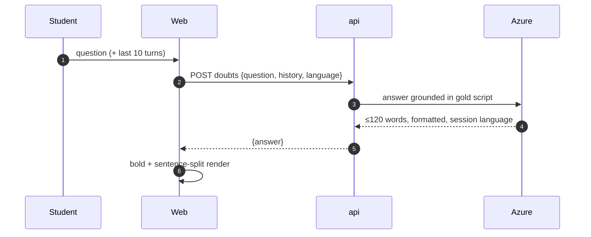
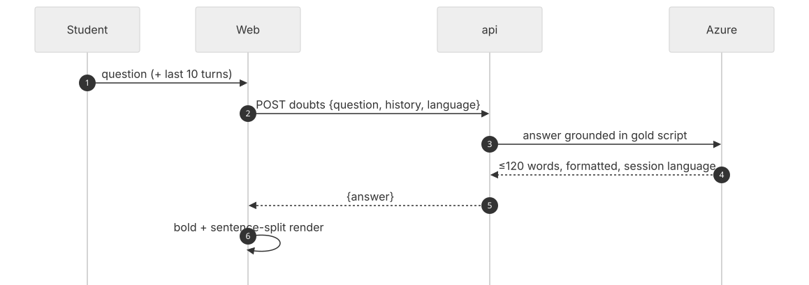

# Key Flows (Auth · Voice Token · Practice Assembly)

## 1. Email auth

## 2. Google auth (sign-in AND sign-up)

One Tap `id_token` first, popup `access_token` fallback; the backend
auto-creates first-timers and links existing password accounts.
Audience is checked against every configured client id.

## 3. LiveKit token (drives the whole voice session)

`GET /token?student_id&topic_id&lang` → concept unlock check (soft warnings),
room name, and job metadata `{topic (script, rubric, lang), student_id}`.
The agent reads `lang` for STT (`hi-IN`), TTS voice, and every prompt word.

## 4. Practice tab assembly (one bundle, four activities)

## 5. Doubts chat (Learn)

